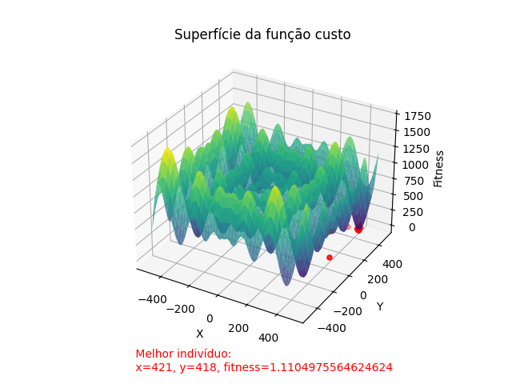

# Trabalho 01: Algoritmos Genéticos

###### Requisitos de Software

- Python
- VSCode

### Instalação

1. Clone o repositório para o seu computador:

```
git clone https://github.com/aasjunior/ldm_algoritmo_genetico.git
```

2. Abra o projeto pelo VSCode e execute o comando pelo terminal: 

```
pip install -r requirements.txt
```

3. Navegue até o diretório `src` e execute:

```Python
python main.py
```
<br>

## Algoritmo Genético

```Python
from versions.version_01 import version_01
from versions.version_02 import version_02
from versions.version_03 import version_03
from helpers.exception import generate_log
import traceback

def main():
    size = 20
    n_childrens = 14
    n_generations = 10

    try:
        version_01(size, n_childrens, n_generations)
        version_02(size, n_childrens, n_generations)
        version_03(size, n_childrens, n_generations)

    except Exception as e:
        print(f'Ocorreu um erro:\n{e}\nÉ possivel visualizar mais detalhes em: error_log.txt\n')
        generate_log(e, traceback.format_exc())

if __name__=='__main__':
    main()
```

A cada execução do código principal, é gerado um relatório com os resultados de cada versão em: [src/docs](src/docs)

* No VSCode: Para melhor visualização dos resultados, abrir arquivo e executar o comando `CTRL` + `SHIFT` + `v`.

```
- docs/
    - results_01.md
    - results_02.md
    - results_03.md
```

<br>

### Versão 01

- **Codificação**: Decimal. 
- **Intervalo**: -500 a 500.
- **População inicial**: 20 indivíduos
- **Tamanho da prole**: 14 indivíduos (equivalente a 70% da população inicial).

- **Função custo (fitness)**:

$$
\text{minimizar } z = 837,9658 -
\sum_{i=1}^2 i \cdot
\sin(\sqrt{i})
$$

```Python
from model.GeneticAlgorithm import GeneticAlgorithm
import numpy as np

def modulo(x):
    return np.where(x < 0, -1 * x, x)

def calc_xi(x):
    return (x * np.sin(np.sqrt(modulo(x))))

def version_01(size, n_childrens, n_generations):
    try:
        fitness_v1 = lambda x1, x2: 837.9658 - calc_xi(x1) - calc_xi(x2)

        algorithm = GeneticAlgorithm(size=size, n_childrens=n_childrens, n_generations=n_generations, mutation=1, interval=[-500, 500], fitness=fitness_v1, for_max=False, version='01')
        algorithm.init()

    except Exception as e:
        raise f'Erro na execução da versão 01:\n{e}\n'
```


<br>


### Versão 02

- **Codificação**: Decimal. 
- **Intervalo**: -5 a 5.
- **População inicial**: 20 indivíduos
- **Tamanho da prole**: 14 indivíduos (equivalente a 70% da população inicial).

- **Função custo (fitness)**:

$$
\text{minimizar } z = 20 + x^2 + y^2 - 10 \cdot (\cos(2\pi x) + \cos(2\pi y))
$$

```Python
from model.GeneticAlgorithm import GeneticAlgorithm
import numpy as np

def version_02(size, n_childrens, n_generations):
    try:
        fitness_v2 = lambda x, y: 20 + (x**2) + (y**2) - 10 * (np.cos(2*np.pi*x) + np.cos(2*np.pi*y))

        algorithm = GeneticAlgorithm(size=size, n_childrens=n_childrens, n_generations=n_generations, mutation=1, interval=[-5, 5], fitness=fitness_v2, for_max=False, version='02')
        algorithm.init()

    except Exception as e:
        raise f'Erro na execução da versão 02:\n{e}\n'
```


<br>


### Versão 03

- **Codificação**: Decimal. 
- **Intervalo**: -2 a 2.
- **População inicial**: 20 indivíduos
- **Tamanho da prole**: 14 indivíduos (equivalente a 70% da população inicial)

- **Função custo (fitness)**:

$$
\text{maximizar } z = e^{x - (x^2 + y^2)}
$$

**Observação:** A função custo original era: 
$$x^{-(x^2 + y^2)}$$ 

No entanto, essa função apresentou desafios na implementação em Python devido a problemas com números complexos e divisão por zero, especialmente durante a plotagem da superfície da função de fitness. Embora os cálculos de fitness dos indivíduos estivessem corretos, os erros ocorreram durante a geração da superfície de plotagem. Para contornar esses problemas e garantir a robustez do algoritmo, a função custo foi modificada para 

$$e^{x - (x^2 + y^2)}$$

Essa nova função mantém características importantes da função original, mas evita os problemas mencionados.

```Python
from model.GeneticAlgorithm import GeneticAlgorithm
import numpy as np

def safe_fitness_v3(x, y):
    return np.exp(x - ((x**2) + (y**2)))

def version_03(size, n_childrens, n_generations):
    try:
        v_safe_fitness_v3 = np.vectorize(safe_fitness_v3)
        fitness_v3 = lambda x, y: v_safe_fitness_v3(x, y)
        
        algorithm = GeneticAlgorithm(size=size, n_childrens=n_childrens, n_generations=n_generations, mutation=1, interval=[-2, 2], fitness=fitness_v3, for_max=True, version='03')
        algorithm.init()

    except Exception as e:
        raise f'Erro na execução da versão 03:\n{e}\n'
```


<br>


<br>

### Analise 

### Conclusão


<hr>

###### Aviso
Este é um trabalho acadêmico realizado como tarefa da disciplina de Laboratório/Computação Natural no 5º Semestre de Desenvolvimento de Software Multiplataforma